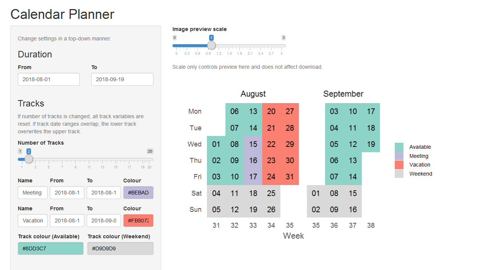

# Calendar Plot

This is an R shiny app to create calendar plot using ggplot2. 



This app requires the following R packages: `ggplot2, shiny, colourpicker`. Run app using `runApp("app.R")`. Click [here](https://roymf.shinyapps.io/calendar_planner/) to see a demo of this app. This link may not always be active.

The app has been tested on:

```
> sessionInfo()
R version 3.5.1 (2018-07-02)
Platform: x86_64-w64-mingw32/x64 (64-bit)
Running under: Windows 7 x64 (build 7601) Service Pack 1

Matrix products: default

locale:
[1] LC_COLLATE=English_United Kingdom.1252 
[2] LC_CTYPE=English_United Kingdom.1252   
[3] LC_MONETARY=English_United Kingdom.1252
[4] LC_NUMERIC=C                           
[5] LC_TIME=English_United Kingdom.1252    

attached base packages:
[1] stats     graphics  grDevices utils     datasets  methods   base     

other attached packages:
[1] colourpicker_1.0 ggplot2_3.0.0    shiny_1.1.0     

loaded via a namespace (and not attached):
 [1] Rcpp_0.12.18     pillar_1.3.0     compiler_3.5.1   later_0.7.3     
 [5] plyr_1.8.4       bindr_0.1.1      tools_3.5.1      digest_0.6.15   
 [9] jsonlite_1.5     tibble_1.4.2     gtable_0.2.0     pkgconfig_2.0.1 
[13] rlang_0.2.1      rstudioapi_0.7   yaml_2.2.0       bindrcpp_0.2.2  
[17] stringr_1.3.1    withr_2.1.2      dplyr_0.7.6      htmlwidgets_1.2 
[21] grid_3.5.1       tidyselect_0.2.4 glue_1.3.0       R6_2.2.2        
[25] reshape2_1.4.3   purrr_0.2.5      magrittr_1.5     scales_0.5.0    
[29] promises_1.0.1   htmltools_0.3.6  rsconnect_0.8.8  assertthat_0.2.0
[33] mime_0.5         xtable_1.8-2     colorspace_1.3-2 httpuv_1.4.5    
[37] stringi_1.2.4    miniUI_0.1.1.1   lazyeval_0.2.1   munsell_0.5.0   
[41] crayon_1.3.4  
```
